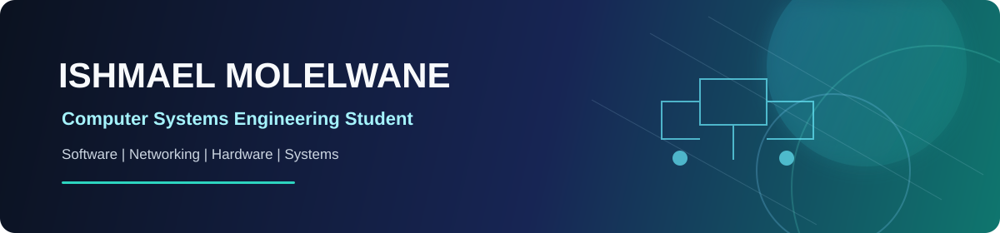

  

# Hi, I'm Ishmael Madala Molelwane

### Computer Systems Engineering Student | Aspiring Systems, Software & Network Engineer

I am a self-driven and curious **BSc (Hons) Computer Systems Engineering** student at Botswana Accountancy College, currently in Year 3 and preparing for industry attachment. I enjoy understanding how technology works across the full stack—from computer hardware and network infrastructure to databases, applications, and user-focused digital products.

I approach technical challenges with integrity, creativity, and a willingness to learn. My current interests include software development, mobile and desktop applications, networking, systems support, hardware diagnosis, debugging, and practical technology solutions.

## About Me

- Based in **Gaborone, Botswana**
- Currently pursuing **BSc (Hons) Computer Systems Engineering**
- Available for a compulsory six-month industry attachment from **11 January 2027 to 30 June 2027**
- Certified in **CCNA: Introduction to Networks**
- Completed **Cisco IT Essentials 8**
- Interested in software engineering, ICT support, network operations, systems administration, and hardware support

## Technical Expertise

### Programming & Application Development

### Frameworks, Platforms & Data

### Networking & Systems

- TCP/IP, IPv4/IPv6 addressing, CIDR/VLSM subnetting, OSI architecture
- Router and switch configuration, Wireshark, packet inspection, and connectivity diagnosis
- PC assembly, component diagnosis, BIOS/UEFI, GPT/MBR storage, and OS deployment
- Windows and Linux administration, preventative maintenance, and technical troubleshooting

## GitHub Activity

  
  

  

  

## Featured Projects

### AccomLink

An Android student-accommodation platform connecting students and landlords through property listings, authentication, favourites, role-based flows, real-time chat, maps, route features, media storage, and payment-related workflows.

**Tech:** Kotlin, Jetpack Compose, Firebase, Firestore, Firebase Storage, OSMDroid  
**Repository:** [cse24-120/AccomLink](https://github.com/cse24-120/AccomLink)

### FNBB Banking System

A JavaFX desktop banking application supporting individual and company customers, account opening, savings, cheque and investment accounts, authentication, deposits, withdrawals, and transaction history.

**Tech:** Java, JavaFX, FXML, Oracle SQL, MVC, repository-based data access  
**Repository:** [cse24-120/FNBB-banking-system](https://github.com/cse24-120/FNBB-banking-system)

### Rashid Electronics

A responsive multi-page electronics e-commerce website with product browsing, product details, cart presentation, account pages, contact functionality, and responsive navigation.

**Tech:** HTML5, CSS3, JavaScript, responsive UI design  
**Repository:** [cse24-120/Rashid_Electronics](https://github.com/cse24-120/Rashid_Electronics)

## Certifications & Training

- **CCNA: Introduction to Networks** — Cisco Networking Academy
- **Cisco IT Essentials 8** — Cisco Networking Academy
- Computer Systems Installation & Maintenance
- Object-Oriented Analysis and Development with Java
- Database Design and Development

## Currently Developing

- Stronger Android and Kotlin application-development skills
- Practical networking and systems-support experience
- Secure, maintainable database-backed applications
- Professional debugging, documentation, and technical communication

## Connect With Me

> Building practical skills, reliable systems, and useful technology—one project at a time.
